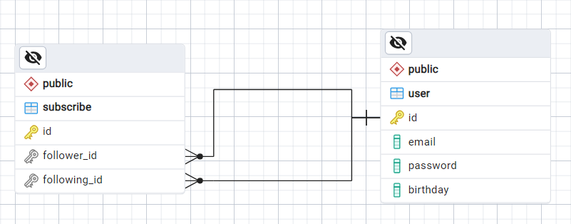

# Gazprom-test

## Описание

<b>Тестовое задание</b> для стажировки в цифровых активах <b>Газпром-медиа.</b>

<b>Cервис для поздравлений коллег с днем рождения.</b>

В качестве веб-фреймворка используется <b>FastAPI</b>.
Авторизация реализованна с помощью <b>JWT</b>.
Для хранения информации была выбрана база данных <b>PostgreSQL</b>,
для миграций <b>Alembic</b>, для взаимодействия <b>SQLAlchemy</b>.
Отправка оповещений на почту происходит благодаря <b>SMTP_SSL</b> и <b>ApScheduler</b>.
Тестирование сервиса проводилось с помощью <b>PyTest</b>.

## Требования

- [x] <b>Модуль авторизации</b>
- [x] <b>Модуль подключения к базе данных</b>
- [x] <b>Модуль подписки</b>
- [x] <b>Модуль оповещения(cron)</b>

## ER-модель



## Развертывание

1. Склонируйте репозиторий:

```shell
git clone https://github.com/sunrekay/gazprom-test
```

2. Перейдите в него:

```shell
cd gazprom-test
```

3. Запаолните пустые поля в .prod.env


4. Соберите контейнеры:

```shell
docker compose build
```

5. Запустите:

```shell
docker compose up
```

6. <b>Swagger UI:</v> http://127.0.0.1:8000/docs
